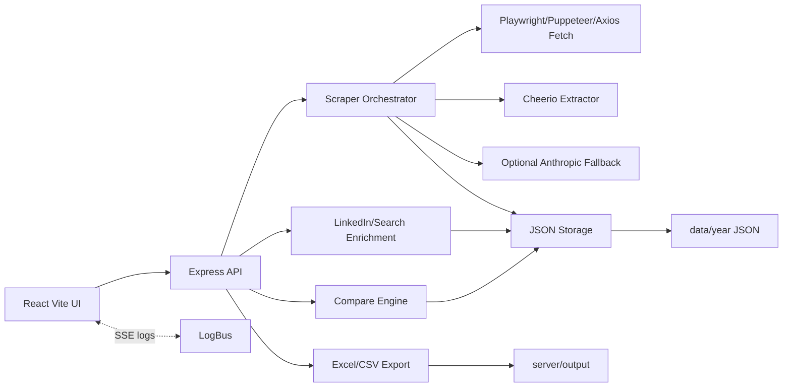
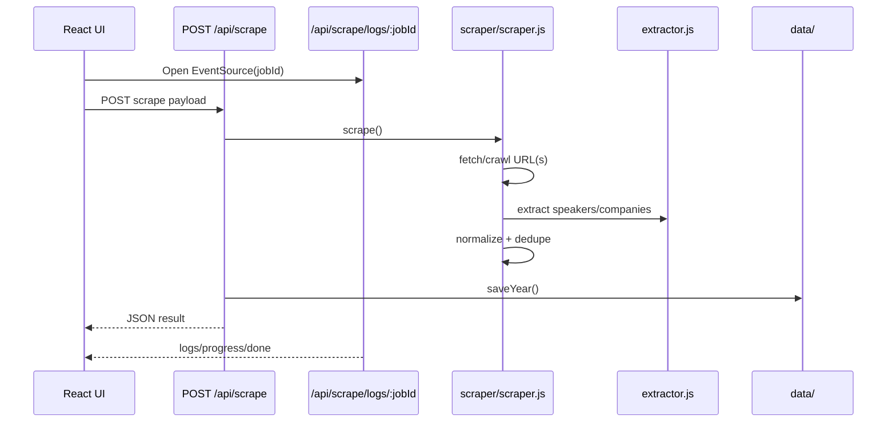

# Architecture

## System Architecture

## Request Flow

### Scrape

### Export

- UI calls `POST /api/generate-excel` or `POST /api/export`.
- Route loads stored year through `loadYear()`.
- Export module creates workbook/CSV/JSON.
- `saveOutput()` writes to `server/output/`.
- UI downloads through `GET /api/download/:filename`.

### Lead Search / Enrichment

- UI calls `/api/search-profiles`, `/api/enrich/batch`, `/api/mine-posts`, or `/api/find-events`.
- `server/src/enrich/linkedin.js` builds queries, searches providers, parses cards, classifies leads, and exports files.
- Provider priority for profile searches:
  - `BRAVE_API_KEY`
  - `GOOGLE_CSE_KEY` + `GOOGLE_CSE_CX`
  - keyless Playwright browser search

## Data Flow

- Input:
  - URL(s), event/year, selectors, crawl options.
  - CSV/text/manual rows for enrichment and list tools.
- Processing:
  - HTML fetch/crawl.
  - Cheerio selector and heuristic extraction.
  - Normalization and dedupe.
  - Optional LinkedIn enrichment and optional AI extraction fallback.
- Persistence:
  - `data/<year>/speakers.json`
  - `data/<year>/companies.json`
  - `data/<year>/meta.json`
  - `data/linkedin-cache.json`
- Output:
  - Download artifacts in `server/output/`.

## Module Relationships

| Module | Depends On | Used By |
| --- | --- | --- |
| `routes/scrape.js` | scraper, enrich, storage, logger | React scraper workflow |
| `scraper/scraper.js` | browser, crawler, extractor, normalize, selectors, AI | `/api/scrape` |
| `scraper/extractor.js` | Cheerio, normalize | scraper orchestration |
| `enrich/linkedin.js` | Playwright, Axios, Cheerio, cache, normalize | enrichment/search/event endpoints |
| `routes/excel.js` | export, storage, enrich manual fields | export workflow |
| `routes/compare.js` | compare, export, storage | year comparison workflow |
| `storage/storage.js` | filesystem | most backend workflows |
| `client/src/api.js` | fetch | all React panels |

## Major Services

- Scraper service: fetches/crawls pages and extracts speakers/companies.
- Enrichment service: LinkedIn matching, X-ray profile search, POC mining, event finding.
- Storage service: year data and generated artifacts.
- Export service: Excel/CSV/JSON output.
- Compare service: exact/fuzzy year comparisons.
- Logger service: per-job progress and SSE backlog.

## Important Design Decisions

- JSON file persistence instead of a database.
- No authentication detected during repository analysis.
- No frontend router; `App.jsx` switches local `view` state.
- SSE only supports scrape logs endpoint; other long-running routes use `jobLogger` but client panels generally wait for response.
- AI extraction is optional and only intended for low-confidence parsing.
- Browser search is keyless by default but can be unreliable on rate-limited IPs.

